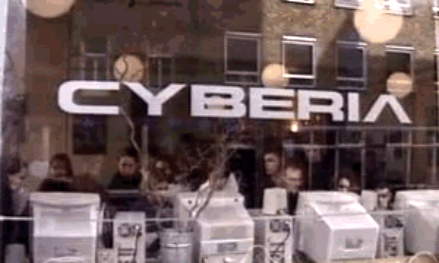

= 30 years of cybercafés
Kieran Potts, 1 September 2024
:description: Cyberia, thought to be the world's first commercially successful \
  internet café, opened in London on 1 September 1994.
:nofooter:

:link-history-hour:   https://www.bbc.co.uk/sounds/play/w3ct4w6c
:link-independent:    https://www.independent.co.uk/life-style/cafe-with-a-mission-to-explain-cyberia-offers-chance-to-check-your-email-and-network-over-coffee-and-croissant-1448226.html
:link-wired:          http://yoz.com/wired/2.04/features/pascoe.html
:link-guardian:       https://www.theguardian.com/technology/2000/apr/27/onlinesupplement
:link-telegraph:      https://www.telegraph.co.uk/news/uknews/1470674/Ten-years-of-Cyberia.html
:link-archives-of-it: https://archivesit.org.uk/interviews/eva-pascoe/
:link-retro-hour:     https://theretrohour.com/cyberia-cyber-cafe-eva-pascoe-ep387/
:link-nytimes:        https://www.nytimes.com/2004/09/02/business/worldbusiness/the-worlds-first-caf-cyberia-in-london-takes-a-bow-a.html

Cyberia, thought to be the world's first commercially successful internet café,
opened in London on 1 September 1994 – 30 years ago today.

.Photo of Cyberia, London, 1994 (source: Wikimedia Commons)

Cyberia was the idea of Eva Pascoe, a Polish immigrant who had moved to
London to study, and later worked as a cognitive psychologist and computer
programmer at City University. She told the BBC's {link-history-hour}[History Hour]
programme: "We always had in mind this concept of a café where people could
learn [about] computers from each other. That was a time when people thought
computer people were geeks and [should] not be allowed out from the university
basements."

Pascoe wanted to "break" this perception. The idea was to make computers more
accessible to the general public – and especially to women – by putting
computers in a homely setting. A café.

Pascoe's interest in computers had started as a child. But when she was growing
up, Poland was behind the iron curtain and sales restrictions made
it difficult to buy new computers. So Pascoe learnt to make her own
computers by glueing together all the individual hardware components, which she
bought second-hand at Sunday markets.

In London, Pascoe was far from home and lonely. She regularly used email
to keep in touch with her family and friends back home. Her realization was that
there must be many other people in London who would like to be able to do that,
too. Her idea was to create a space where people could get together and learn
from each other how to use computers and the internet for long-distance
communication.

Pascoe took a lease on a corner shop at 39 Whitfield Street in the
heart of London's West End. The co-founders – Eva Pascoe, Keith and Gene
Teare, and David Rowe – "were working until about two in the
morning, painting, finishing the interior," Pascoe told History Hour. On the
morning of the opening Pascoe was "still running around trying to get supplies
of cakes."

The name of the café is a play on the words "Siberia" and "cyberpunk". Pascoe
explained to the History Hour programme that the Russian province of Siberia
"was always talked about in the cyberpunk community as this futuristic place
[where] things will be different, things will be run by tech."

Cyberia was an instant hit, despite not being promoted. The co-founders told
only a few friends. But "virtually the whole world came," Pascoe says.

Through word-of-mouth, the café became _the_ place to go in London to experience
for yourself this new thing called "the internet". People flocked to Cyberia to
send emails and to chat with other people from all around the world. The
mid-1990s – for those of you too young to know this – was still the time of
typewriters, fixed-line telephones, and fax machines. Computers were
increasingly common in offices, but few people had them in their homes, let
alone their pockets. For most people, the idea of using IT for _social_
communication was novel.

Located around the corner from a music recording studio, Cyberia was visited by
the likes of Mick Jagger, David Bowie, and Kylie Minogue – propelling the café's
popularity further. Within a few years, Cyberia had been franchised in
Manchester, Edinburgh, Dublin, Rotterdam, Bangkok, Manila, Tokyo, and Paris. By
1996 there were about 200 cybercafés overall worldwide, copying the Cyberia model.
Within 10 years there were estimated to be 20,000 cybercafés globally.

.The earliest capture of cyberiacafe.net on the Internet Archive, 14 April 1997

The idea was of its time. Cyberia was not _quite_ the first internet café in
the world. At least a couple of others just pipped it to that post. The term
cybercafé had been coined by Ivan Pope, a technologist, a few months prior for an
event at London's Institute of Contemporary Arts. At about the same time, in
Toronto, a place called
"link:https://scribble.com/jon/bincaf/[The Binary Cafe and Hexadecimal Emporium]",
which sold cyberpunk-related books and magazines alongside food and drink, had
started renting out a couple of x86 computers, connected to the internet through
a shared connection. I find it hard to imagine that there were not others doing
similar things in other cities in the world, but their digital footprints have
been lost to history.

Nevertheless, Cyberia can lay claim to being the first mainstream internet café.
It proved that the cybercafé concept had mass appeal, beyond the cyberpunk and
hacker subcultures, and was a commercially viable business model.

Computing had originated in academia and later moved into military and enterprise
domains. It was relatively late in the evolution of computer science that IT
became affordable and accessible enough for adoption by the general public, and so
begun transforming social life into what we know today. You can't put an exact date
on when that transformation started, but the opening of Cyberia on 1
September 1994 certainly marks a watershed moment in that process.

.Sources and related links
****
* {link-history-hour}[The History Hour: Internet cafes and Doomsday seeds], BBC Sounds (2024)
* {link-retro-hour}[Cyberia: Revisiting The Cyber Cafe with Eva Pascoe], The Retro Hour (2023)
* {link-archives-of-it}[Interview with Eva Pascoe], Archives of IT (2019)
* {link-telegraph}[10 years of Cyberia], The Telegraph (2004)
* {link-nytimes}[A decade of internet cafés], The New York Times (2004)
* {link-guardian}[Girls' night out on the net], The Guardian (2000)
* {link-wired}[All about Eva], Wired (1996)
* {link-independent}[Cafe with a mission…], The Independent (1994)
****
