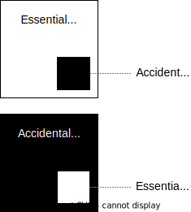

= Mental models: essential versus accidental complexity
Kieran Potts, 7 December 2024
:description: A mental model for thinking about the relative importance of \
  essential and accidental complexity.
:docinfo: shared
:nofooter:

This post describes a mental model for thinking about the relative weight that
should be put on the management of essential and accidental complexity in
software systems.

Complexity in software systems can be divided into two categories: essential
complexity and accidental complexity.

The concepts of essential and accidental complexity were introduced by Fred
Brooks in his influential 1986 paper "No Silver Bullet: Essence and Accidents of
Software Engineering". In this paper, Brooks defines essential complexity as the
complexity that is derived from the problem that a software system is designed
to solve. Accidental complexity is the complexity that is introduced by the
developers of the system through choices they made in its design.

All software has essential complexity, because that is inherent in the functions
and operations provided by the software. And all software has accidental
complexity, because the design of software involves trading off competing
constraints and properties. Neither type of complexity can be avoided entirely,
therefore.

Good system design is about managing complexity, not eliminating it.

A key consideration in the management of complexity is the relative balance
between the essential and accidental forms of it.

Ideally, of course, both forms of complexity would be minimized. But in practice
you often need to prioritize managing one of the two forms of complexity.

Consider, for example, a small utility program that runs on a single machine in
a single process, and that performs one well-defined task. This is an inherently
simple program. It has low essential complexity. Therefore, there is less need
for such a program to be well designed and well constructed. The code may not be
pretty, and the structure of the code may be a bit of a mess. But it doesn't
matter too much because the program is still easy to change. The focus here
should be on maintaining the essential complexity of the program, keeping it
simple and focused on its core task.

Next, consider a complex, large-scale, distributed system. It has much greater
requirements on its design and construction to be of high quality. This is
necessary to maintain relatively low development, maintenance, and operation
costs at such a scale.

I like to think of the relative balance between essential and accidental
complexity as being like a set of scales, or a seesaw. On one side is essential
complexity, and on the other side is accidental complexity. In most systems, you
will find that one of the two types of complexity will weigh more than the
other.

In an essentially complex system, the focus should be on managing the accidental
complexity, because the developers will have more control over this. Conversely,
in essentially simple systems – in which the domain suggests that scope will
not substantially increase over time – you can afford to let some accidental
complexity creep in. If the requirements are relatively stable, the system will
not change much, and therefore refactoring work yields little value.

Another visual metaphor is to think of a system's complete bundle of complexity
as an area diagram. The total area is made from a proportion of essential
complexity and a proportion of accidental complexity. The overall volume of
complexity is less important than the relative proportions of the two types of
complexity that make up the whole.

The top diagram is what you want to aim for. The bottom diagram is what you
can sometimes get away with.

