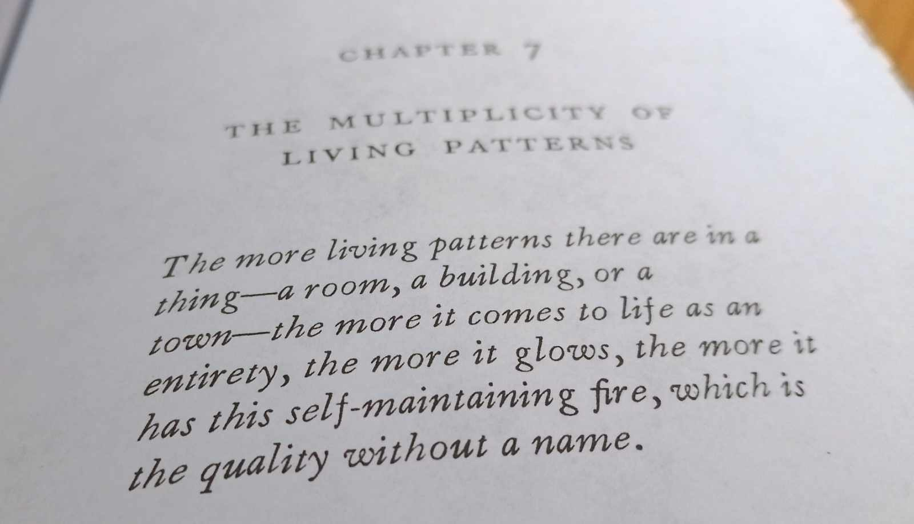

= The (software) quality without a name
Kieran Potts, 5 October 2025
:description: The Timeless Way of Building by Christopher Alexander is a classic text on real-world architecture. In computing, it was influential in the emerging field of object-oriented programming in the late 1970s and 1980s. The book still has much to teach us about how we think about software design.
:docinfo: shared
:nofooter:

:link-pattern-language: https://www.patternlanguage.com/
:link-patterns-of-software: https://dreamsongs.com/Files/PatternsOfSoftware.pdf
:link-wikipedia: https://en.wikipedia.org/wiki/The_Timeless_Way_of_Building

Christopher Alexander's _The Timeless Way of Building_ is a classic text in architectural theory. It is widely admired in its industry for its provocative views on urban design. Beyond architecture of the built environment, it found popularity in the object-oriented programming community in the 1980s and 1990s. Decades later, it continues to offer lessons in how to approach software design, reminding us that the habitability of a codebase is just as important as its structural integrity.

My holiday reading this year was {link-wikipedia}[_The Timeless Way of Building_] by Christopher Alexander. Published in 1979 and now regarded as a classic text in the field of built environment architecture, the book is a philosophical and practical exploration of the patterns that make some buildings and places feel alive, harmonious, and emotionally resonant.

Alexander calls this the quality-without-a-name. It's that _je ne sais quoi_ that some buildings and urban spaces have, that can't be easily expressed in words – but we know it when we see it.

[quote, Christopher Alexander (1979)]
____
The first place I think of when I try to tell someone about this quality is a corner of an English country garden where a peach tree grows against a wall.

The wall runs east to west; the peach tree grows flat against the southern side. The sun shines on the tree and, as it warms the bricks behind the tree, the warm bricks themselves warm the peaches on the tree. It has a slightly dozy quality. The tree, carefully tied to grow flat against the wall; warming the bricks; the peaches growing in the sun; the wild grass growing around the roots of the tree, in the angle where the earth and roots and wall all meet.

This quality is the most fundamental quality there is in anything.
____

The central premise of the book is that this elusive architectural characteristic need not be left to emerge by accident, for it can be intentionally designed through the reuse of timeless design patterns that recur throughout history and across cultures.

The quality-without-a-name comes about, not from adherence to any particular architectural style or trend, but from a deep understanding of human needs and the rhythms of life. Buildings and urban spaces feel alive when they are thoughtfully shaped to support universal patterns of human experience, rather than being designed for the sake of aesthetic fashion or architectural exhibition.

This is the "`timeless way of building`" referenced in the book's title. It is a natural, organic process that has shaped architecture across cultures for centuries. It is a methodology that draws on universal patterns that have emerged independently around the world and passed down through generations of builders and architects.

These "`living patterns`" appear in villages, temples, and homes across time and geography. They are rooted in human needs and lived experiences. When the patterns are carefully combined and adjusted to fit the needs of the inhabitants, they give rise to buildings and urban environments that are functional, beautiful, and emotionally satisfying. Such spaces are imbued with that intangible quality — the quality-without-a-name.

Alexander contrasts the timeless way of building with modern global architectural styles and industrialized construction methods, which tend to produce buildings that are missing this indescribable quality.

I was reading this wonderful book while holidaying in Dubai, a city characterized by its showpiece mega-projects, the effect of which is a rather soulless, rootless urban landscape. Yet even here I found a few quiet corners, hidden among the glass and steel towers, some https://www.hilton.com/en/hotels/dxbasqq-al-seef-heritage-hotel-dubai/[heritage buildings] and sanctuaries like https://alserkal.online/[Alserkal Avenue], that exist on a human-scale and have something of the quality-without-a-name within them.

.Archaeological site in Jumeirah, Downtown Dubai in the distance
image::./_/media/images/jumeirah-archaeological-site.jpg[]

Alexander's work has been influential in fields beyond architecture.  His design philosophy found popularity in the field of software design in the 1980s and 1990s, during the rise of object-oriented programming and its associated design patterns.

Richard P Gabriel, the computer scientist known for his work related to the Lisp programming language, explored Alexander's ideas in the context of software design through a series of articles published in the _Journal of Object-Oriented Programming_. Gabriel later compiled these essays into a book titled _Patterns of Software: Tales from the Software Community_, published in 1996 and now {link-patterns-of-software}[available freely from his website]. Christopher Alexander wrote the forward to Gabriel's book. It is a wonderful anthology of essays, full of ideas that are still pertinent today.

Gabriel was an early advocate of applying Alexander's concept of pattern languages to software design. He argued that software systems, like buildings, can benefit from the use of recurring design patterns that address universal needs in software.

Today, the idea of design patterns is well established in our field. The influential book _Design Patterns: Elements of Reusable Object-Oriented Software_, published in 1994 by the "`Gang of Four`", gave us much of the shared vocabulary we use to communicate software design ideas.

But there is another idea from Gabriel's essays that I find particularly compelling and relevant to software design.

It's the idea of habitability.

Habitability is a characteristic of a software system that refers to how comfortably software developers can live and work with the codebase, how intuitively they can navigate and understand it, and how confidently they can change it.

Gabriel draws the metaphor of habitability from Alexander's architectural philosophy. Just as buildings must be livable for their generations of occupants, so software systems must be habitable spaces for the generations of programmers who analyze, maintain, and extend them.

[quote, Richard P Gabriel]
____
There is a pleasure in creating well-written, understandable programs. There is a satisfaction in finding a program structure that tames the complexity of an application. We enjoy seeing our algorithms expressed clearly and persuasively. We also profit from our clearly written programs, for they are much more likely to be correct and maintainable than obscure ones.
____

You most commonly find the quality of habitability in smaller programs, particularly open source projects written by a single developer or guided by a https://producingoss.com/en/benevolent-dictator.html[benevolent dictator]. Such programs tend to have high conceptual integrity, meaning their design is coherent and consistent throughout. They are well-factored, with good separation of concerns and modularity, enough that individual parts can be understood and modified in isolation of all the other parts. Consistent coding conventions, concise documentation, and comprehensive tests make these software projects easily accessible to external contributors, both expert and novice. Critically, design decisions prioritize ease of understanding and changeability.

Many of https://github.com/search?o=desc&q=stars%3A%3E0&s=stars&type=repositories[the great free and open source software projects] are wonderfully habitable spaces for computer programmers. They must be. The success of these kinds of software projects depends on programmers being willing to donate their free time to them.

The challenge is to maintain habitability in large, complex software systems that are developed through peacemeal change by revolving teams of programmers over many years.

In software design, requirements are never static. Business priorities shift, technologies advance, vulnerabilities surface, regulations tighten. Software is never truly finished. Developers must continuously adapt it to meet ever-changing requirements. And the ownership of a codebase may change many times over its lifetime, losing a little knowledge with each change of hands.

All this constant, perpetual change makes it hard to maintain a codebase as a habitable space.

Christopher Alexander's book suggests how we might preserve habitability in long-lived systems that are subject to continuous change and turnover of occupancy. Drawing on examples from Alexander's work, Gabriel contrasts two very different approaches to design:

[quote, Richard P Gabriel]
____
A modern skyscraper[…] has a fixed inflexible interior, which is secondary to the designed beauty of the exterior. Little attention is paid to the natural light, and often the interiors are constructed as “flexible office space,” which means cubicles. The flexibility is for management to set up offices for the company, not for the inhabitants — the employees — to tailor their own space. When you run out of space in the skyscraper, you build another; you don't modify the existing one or add to it.

Contrast this with the New England farmhouse. It starts as a small home with a barn out back. As the family grows and the needs of the farm grow, a back room is added to the house, then a canning room, then a room for grandma; stables are added to the barn, then a wing for milking more cows. Finally the house and barn are connected because it is too difficult to get from the house to the barn in a blizzard. The result is rambling, but each part is well-suited to its needs, each part fits well with the others, and the result is beautiful because it is a living structure with living people inside. The inhabitants are able to modify their environment because each part is built according to familiar patterns of design, use, and construction and because those patterns contain the seeds for piecemeal growth.
____

We tend to think of the construction of physical buildings as being one-off projects that are fully designed and planned up-front, then constructed in a single step, like a modern skyscraper. But this stepwise approach to the built environment is a relatively recent phenomenon. For most of human history, buildings were constructed incrementally, evolving over time to meet the changing needs of their changing inhabitants, like a New England farmhouse.

[quote, Christopher Alexander (1975)]
____
Each new building is not a “finished” thing… They are never torn down, never erased; instead they are always embellished, modified, reduced, enlarged, improved. This attitude to the repair of the environment has been commonplace for thousands of years in traditional cultures. We may summarize the point of view behind this attitude in one phrase: piecemeal growth.
____

The development of software has more in common with the traditional, timeless way of building than the modern one. The software systems that prove to have long, useful lives tend to have more in common with a New England farmhouse than a modern skyscraper. They are developed incrementally, through piecemeal growth, by various people who come and go. For every incremental change, the design is iterated to accommodate the new requirements, and to maintain the conceptual integrity of the overall design.

Habitability is maintained through continuous redesign.

And yet Alexander does not advocate that architecture be purely evolutionary. On the contrary, his design philosophy is aligned with that we call top-down design in software. In Alexander's view, changeability is an intrinsic quality of buildings, a quality that must be explicitly designed for. Similarly in software design, how a program looks in the end is not as important as how it can be changed in the future. Good software design is about creating a habitable space for programmers to continuously change a system.

In a top-down design process, you start with a clear understanding of the overall architectural style that you want to achieve, and the architectural patterns that you want to use. With a design framework established, the solution is broken down into a hierarchy of smaller patterns. Additional levels of components, and interactions between them, are added incrementally, until the complete system is fully specified. Top-down design contrasts with a bottom-up approach, in which a system is built from a library of small, primitive components, gradually integrated together until a complete solution emerges, but without an overall design framework to guide the build.

Alexander argues that a good building design mirrors the structure of the problem that the building addresses. This demands that the design process begins with a thorough analysis of the requirements, followed by high-level design of a structure that reflects the functional hierarchy of those requirements. Now, the problem is decomposed into small parts, each having a place within the grand design, and each fulfilling a specific function that meets a specific requirement.

The high-level design of a software system, planned up-front, provides a stable skeleton into which functionality is added and reshaped, incrementally, indefinitely. This aspect of the design also deals with cross-cutting concerns that are difficult to retrofit later. These are the performance requirements of the software: it's security, scalability, availability, consistency… and its changeability.

Alexander distinguishes between the "`needs of the whole`" — the fixed requirements of the overall design — and the "`needs of the parts`" — the changing requirements of individual components within the overall design.

If we apply this design philosophy to software, we see that habitability is best preserved when the high-level design of a software system is shaped by the business domain and is kept true to its purpose, while the low-level details within that structure are allowed to evolve in response to changing requirements within the problem space.

Gabriel draws a parallel between Alexander's design philosophy and that of Frank Lloyd Wright, the renowned American architect known for his organic architectural designs. Wright's buildings often embody a strong sense of coherence, with every element carefully integrated into a harmonious whole. Like Alexander's buildings, Wright's buildings have a sense of unity with the natural environment and with humanity.

The problem is you cannot easily change a Frank Lloyd Wright building. His rigid designs prioritize the conceptual integrity of the whole over the adaptability of the parts.

Wright's design philosophy neglects the changing needs of inhabitants. Alexander's design philosophy embraces change.

Central to Alexander's thesis is that, in embracing changing requirements, we cannot separate design from construction. The mainstream approach to architecture is for architects to be hired to solve problems for their clients, and then hand-off architectural drawings, which offer solutions to those problems, to builders who are tasked with constructing the building to the specified blueprint. The equivalent process in software design is colloquially known as being "`waterfall`" or "`stepwise`".

Alexander rejected this model. Instead, he advocated a user-centered design in which an architect, who is also the builder, would collaborate closely with the customer to help them shape their own environment.

[quote, Christopher Alexander (1975)]
____
Master plans have two additional unhealthy characteristics. To begin with, the existence of a master plan alienates the users… After all, the very existence of a master plan means, by definition, that the members of the community can have little impact on the future shape of their community, because most of the important decisions have already been made. In a sense, under a master plan people are living with a frozen future, able to affect only relatively trivial details. When people lose the sense of responsibility for the environment they live in, and realize that there are merely cogs in someone else's machine, how can they feel any sense of identification with the community, or any sense of purpose there?

Second, neither the users nor the key decision makers can visualize the actual implications of the master plan.
____

''''

On the surface, Christopher Alexander's _Timeless Way of Building_ — and other books in the series — is about a particular approach to the design of buildings. But Alexander's design philosophy transcends its immediate subject matter and offers profound insights into the nature of design itself.

Alexander's advocacy of user-centered approaches to design, the prioritization of characteristics like ease of repair and extension, and the use of timeless patterns that evolve organically from human needs, are ideas that are just as applicable to software design as they are to building design.

In translating Alexander's design philosophy into the field of software design, Richard P Gabriel gave us a name for Alexander's quality-without-a-name, which emerges from this timeless way of building. Habitability.

Habitability is the ultimate sophistication in software design. It goes beyond changeability. It is a quality that makes a codebase not merely comfortable to change, but welcoming, delightful, and joyous. Software with this transcendent quality is a space in which time passes by unnoticed, where you work late into the night, as engrossed in the art of computer programming as you were the day you discovered it, a lifetime ago.

As in real-world architecture, habitability in software is achieved through user-centered design. The "`user`" here is not the end user, but the inhabitants of the code — the developers. Habitability is realized by giving developers the freedom to shape their own working environment, by continuously refactoring the code and the data, by keeping their tools sharp, by choosing their teammates, and by working whatever ways suit them best.

.Related links
****

* {link-pattern-language}[PatternLanguage.com], a member-supported website run by The Center for Environmental Structure, Christopher Alexander's architectural practice

* {link-patterns-of-software}[Patterns of Software: Tales from the Software Community], Richard P Gabriel, Oxford University Press, 1996

****
