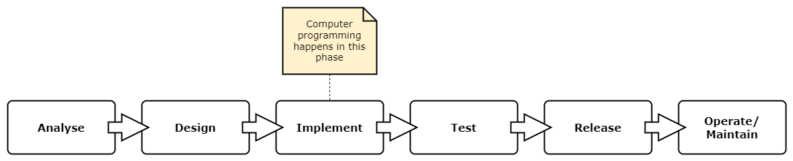

= What advise would you give your younger self?
Kieran Potts, 1 December 2023
:description: If you could travel back in time to the start of your career in software development, what advise would you give your younger self?
:nofooter:

*If you could travel back in time to the start of your career in software development, what advise would you give your younger self?*

My previous employer, https://www.bjss.com/[BJSS], runs a wonderful https://www.bjss.com/academy[academy scheme] for graduates and career-switchers, and anyone else looking for a pathway into a new area of IT. I did some of the technical interviews. At the end I would invite candidates to ask me any questions they liked. Late last year, an especially impressive young person asked me this:

[quote]
What advise would you give me, at this point in my career?

The question took me by surprise. I had never been asked this before. I admit I somewhat fumbled my answer. For days afterwards I kept thinking about it. If I could travel back in time to the beginning of _my_ career, what advise would I give my younger self?

After more consideration, here's my answer.

There are five things I wish I had known at the start. It's not a definitive list, but these are the top five ideas that have influenced my thinking about professional software development.

////
What do _you_ wish you could tell your younger self? You can discuss this topic in link:https://xxxx[this Hacker News thread.]
////

== 1. Grow to be a T-shaped developer

To get your first job as a professional software developer, some level of education or (non-commercial) experience in _computer programming_ is required. All employers will expect you to be able to write a computer program that correctly implements some functional requirements, and to do this with minimal guidance from other people.

This is the essence of computer programming: to translate a problem into a solution in code.

_Software development_ is a much broader activity. Computer programming sits at the centre of the software development life cycle. It's the core activity, but it's not the only thing that happens.

I would define software development as a formal process for managing and coordinating change in a software system, as requirements and understanding evolve over time. Software development involves gathering and analyzing requirements from the business or consumers who will use the software. It requires an understanding of the constraints under which the system must operate, and an ability to manage the risks with its delivery and operation. Software development involves designing solutions and understanding the trade-offs between different designs. It involves evaluating the appropriateness of a solution through user feedback, and verifying a system's correctness through testing. And much else besides.

Universities and bootcamps will teach you to be a computer programmer, but in the real economy you will need to learn to be a software developer. Sure, on large-scale projects especially, developers will be supported by other domain specialists like business analysts, quality assurance engineers and project managers. But the commercial reality is that developers are often expected to take on at least some of these additional roles and responsibilities.

.One possible representation of the software development life cycle

The traditional roles in software development are blurring. The recent trend has been towards cross-disciplinary engineering teams where everyone "shifts left" and "shifts right", working across all phases of the software development life cycle, collectively managing each change all the way from requirements gathering to testing and release. In modern DevOps practices, the development ("dev") teams are also responsible for supporting and operating ("ops") the software they make, once it hits production.

It's tempting, early in your career, to focus on the technical aspects of software development, particularly the core discipline of computer programming. I did this. Early in my career, I invested lots of time up-skilling in technical expertise, learning more computer languages, more software platforms, more application frameworks and more automation tools. I aspired to be an "I-shaped" developer, with deep knowledge of computer programming and specialization in a particular technology stack.

But I added the most value to projects by honing my skills in other areas of software development and maintenance, especially analysis, architecture and testing. Increasingly, cloud operations is a highly desirable knowledge area, too.

The more flexible you are at working across the whole life cycle of a software change, the more employable you will be. In my experience, organizations tend to hire specialists, but in reality they most value generalists – people who can do a bit of everything. Versatility means you can fill temporary gaps in capacity and capability, and easily switch between different projects and teams as the business needs change.

This means growing into a "T-shaped" developer: have deep working knowledge of one primary technology stack, but balance this with wide general knowledge, not only of other technologies, but also of all the other disciplinary fields that are required to deliver commercial software.

This advice will not be applicable to every software development job. But it will certainly be true for consultancies and many startups, and large swathes of the rest of the industry.

== 2. Most things with the word "agile" in the title are bollocks

The quality of a software system is shaped by the process followed to make it

////

Process is everything. Unless you are lucky enough to be working in the IT sector, you will most likely be creating software for non-IT organizations, ie. other business domains. This means working with stakeholders that don't understand the software domain. This is a major source of conflict. … Business people tend to want result, results… Task-driven not quality-driven. Focus on speed/velocity of delivery. But making bespoke software systems is more like a craft… This is the source of the enduring software crisis.

------

Broadly, there are two types of work we do:

- We write code that is "correct" to a specification of functional and non-functional requirements. EXAMPLE...
- We design software systems that are easy to change - to maintain and extend and to debug and diagnose etc. EXAMPLE...

The second is primarily the design consideration.

What is surprising is the degree to which the quality of the design of a software system is determined by the process by which the system is built.

The reality of developing commercial software is that you will not get complete freedom - all the time and resources you need - to design a solution to meet the second objective. You will be constrained by the business context in which you are working. You will be constrained by the people you are working with. You will be constrained by the process you are following. You will be constrained by time and budget.

So the process -- the work culture, or the ways of working, and how the SDLC is managed -- is a critical factor in the quality of the software system that is produced. This sets up the constraints within which the system is constructed.

You will be constrained by time and budget, and perhaps by other things like parallel work and rapidly changing requirements, etc.

Process matters.

This is probably the most troublesome aspect of software development. We can't even agree on the terminology we use to describe processes. "Agile", notoriously, means different things to different people in different contexts. Scrum is widely considered to be an agile development framework but it has little in common with the manifesto.

The sad reality is that there's is a lot about modern software development practices that actually _impedes_ our ability to design good quality solutions. The most obvious example is the obsession with "velocity" and "productivity" and "efficiency". These are all good things, but they are not the most important things. The most important thing is the quality of the software system that is produced. And the quality of the software system that is produced is determined by the process followed to make it.

Unless you are working in high integrity software -- that is, software that is required to meet very high quality standards / NFRs -- then process tends to be designed in a way to optimize developer's time to / incentivize developers ot focus on functional delivery, rather than building solutions to last.

This is very unfortunate. It is surprising at how few organization are good at making software. It is surprising at how few organizations are good at managing software development projects. It is surprising at how few organizations are good at managing change in software systems. ... Almost all organizations in the modern world is an IT company of some sort. Even organizations in business domains like retail and banking and manufacturing and healthcare and government are, in reality, IT companies. They will have an IT function.

This is great for employment, but it has the downside that you will likely work in organizations that are not specialists in software. The professional software houses -- the ones who _are_ good at managing change in software -- are those whose own products and services are software systems. But they only make up for a fraction of the overall employment market.

So the chances are, for much of you career, you will be working in corporate environments that are not optimized for software development. That is the reality of working in the software industry in the early twenty-first century.

----

In the real world, some software projects succeed, and many fail. There are multiple factors that determine whether a software project succeeds or fails. You would expect technical expertise to be one of the most critical factor. But it isn't. Whether a software system meets the requirements of the customer or end user has very little to do with the technical capabilities of the team of people who made it. It has everything to do with the process followed to make it.

Software development is a messy process and a risky business activity.

Computer programs are destined to take on the shape and characteristics of the organizations that make them.

SDLC

Incremental build, iterative design - we have always done this

A LOT of different approaches to managing change in software systems... and that's why there is such variety in the ways of working in software development.

Look for good fit in terms of process, not just tech stack.

- Accelerate by Nicole Forsgren, Jez Humble, Gene Kim — The definitive guide to DevOps. A classic. So hugely influential it is widely known as the "DevOps" book.
- Extreme Programming Explained by Kent Beck — The definitive guide to doing agile properly.
- The Pragmatic Programmer by Dave Thomas Andrew Hunt — The definitive guide to being a professional software developer. Packed full of practical advice.
- Design Patterns by Erich Gamma, Richard Helm, Ralph Johnson, John Vlissides — The definitive guide to design patterns. A classic. So hugely influential it is widely known as the "Gang of Four" book.
- Refactoring by Martin Fowler — The definitive guide to refactoring. A classic. So hugely influential it is widely known as the "Refactoring" book.
- Domain-Driven Design by Eric Evans — The definitive guide to domain-driven design. A classic. So hugely influential it is widely known as the "Blue Book". This is not an easy book to understand but it is full of great ideas. In my opinion, this is the gold standard for the architecture of any computer program.

////

== 3. Your technical expertise is surprisingly unimportant

After your first break in the industry, you will progress through the levels of seniority with time and experience. But to progress to much higher paying jobs, developing larger scale or more critical systems, you will need to polish your soft skills.

That's because software development is fundamentally a social process. It is highly collaborative in nature. At the very least, successful delivery of commercial software requires the technicians to collaborate closely with the customer – the business or consumer for whom the software is a solution to a problem – or a representative of them. Probably you will need to collaborate with many other stakeholders besides.

Soft skills are the skills that enable you to work effectively with other people. They are what will help you to negotiate and to compromise, to manage expectations and judge risk, and to empathize with people and to see problems from multiple perspectives.

Some of the best people I have worked with were not, in fact, the best programmers. But they were great communicators – listeners as well as broadcasters. They could take complex ideas and distill them down to their essence. They could explain technical concepts to non-technical people, using the language of the business domain rather than their own technical domain, or using metaphor or visualization. They could translate ideas bidirectionally between the two worlds of the business and the technologists.

And they were just nice people. Good at their job, proud of their work, but humble about it.

////
More broadly, the best _teams_ were the most skilled in soft skills. They were the teams that were the most collaborative, the most open to new ideas, the most willing to compromise, the most willing to admit mistakes and learn from them, the most willing to share knowledge and help each other out.

The technically-brilliant teams were the most difficult. They were the teams that were the most competitive, the most argumentative, the most defensive, the most resistant to change, the most resistant to new ideas, the most resistant to compromise, the most resistant to admitting mistakes and learning from them, the most resistant to sharing knowledge and helping each other out.
////

Hard skills matter less as your career progresses, and soft skills matter more. Even if you are blessed with natural emotional intelligence, critical thinking abilities and other personal attributes that make for a good technical leader, it will still be worth your time investing in some good books and courses to give yourself a theoretical grounding in the subject of soft skills.

////
Avoid brilliant jerks...

----

aka. people skills, aka. social skills, aka. emotional intelligence, aka. EQ

Distinct from hard/technical/professional skills... but arguably more important. Software development is primarily a social activity.

Separate from personality. Soft skills can be learnt, though natural emotional intelligence can be a big help!
////

////
Software-enhanced process, eg. passport application. You need to understand the business domain to be able to effectively automate aspects of it.
////

== 4. Very little, if anything, is new

////
Learn about old technology, not just new technology

Techies tend to be early adopters. New is synonymous with better. Value creativity and seek out innovative new ways of doing things, assuming those to solve some problems with current methods and tools.

----

Something you will probably struggle with, early in your career, is the need or desire to want to keep up-to-date with all the latest tech, all the languages and tools that turn up in your newsletters or your Hackers News feed or your Twitter timeline. After a few years you will realize that, actually, very little is new in the world of software development. Most of the new stuff is just a rehash of old stuff. And most of the new stuff is not worth learning.

Very little of it has big implications for how you work, for the developer experience and your level of productivity.

What you really need to learn is the essence of what we do and of the technology, and to understand that you really need to go back in time and learn about the history of the technology stack in which you work.
////

The software industry moves fast. New technology is invented all the time. New computer languages, new software platforms, new application frameworks and new development automation tools. Some of it is genuinely useful, improving significantly on what came before. But most of it is not.

The truth is technology changes only incrementally.

Consider the latest hype around generative AI. This is a new category of tool that promises to help us to develop software systems faster. We can use gen-AI tools like GitHub Copilot to generate code from natural language descriptions of a problem. I think much of the hype around gen-AI is, in fact, justified. This is a legitimate step-up in technological capability. But it is just the latest in a long history of innovations that have automated aspects of software development. And, like all the prior innovations in development automation, gen-AI will have only an incremental impact on our productivity.

Why? Because gen-AI helps us to write code a bit faster, but that's all it does. It saves us a little time stitching together snippets of text from documentation sites and StackOverflow. It does nothing to speed up all the other aspects of our work, and all the other stages of the software development life cycle. And it does not help me to _think_ faster.

////
TODO: Diagram of the SDLC, showing computer programming as just one activity in the process.
////

The previous hype cycle in development automation was, probably, the no-code/low-code movement. This was not new at all. It's what "classic" Visual Basic did in the 1990s, which itself was preceded by visual programming languages like Pygmalion and GRaIL (the Graphical Input Language) all the way back in the 1960s and 1970s. The idea was repackaged to sell a new generation of application frameworks and runtime platforms to a new generation of developers. It's useful stuff, certainly. But the reality is this particular category of tooling serves only a niche market. No-code/low-code software development platforms will not change how most of the industry makes software.

////
Brooks added the chapter "No Silver Bullet-Essence and Accidents in Software Engineering" and further reflections on it in the chapter "'No Silver Bullet' Refired" to the anniversary edition of The Mythical Man-Month.

Brooks insists that there is no one silver bullet: "there is no single development, in either technology or management technique, which by itself promises even one order of magnitude [tenfold] improvement within a decade in productivity, in reliability, in simplicity."
////

[quote, Fred Brooks, The Mythical Man-Month]
There is no single development, in either technology or management technique, which by itself promises even one order of magnitude [tenfold] improvement within a decade in productivity, in reliability, in simplicity.

If you are new to this industry, I would encourage you to spend some time learning about the history of your current tech stack. For example, if you are working with TypeScript and React, then you should learn about the history of TypeScript and React. Why were these invented? What problems were they trying to solve at the time? Are those problems still relevant?

Then go deeper and learn about the history of JavaScript and the history of the web platform. Only when you understand the trade-offs made in the design of the underlying platform will you be able to properly evaluate the costs versus benefits of new solutions, like TypeScript and React, that are built on top of it.

This is how you break free from the hype cycle and make informed decisions about which technologies to invest in, rather than being buffeted by the latest fads. This is the foundational knowledge you need to be able to spot the imitations from the innovations, and to make critical judgments about whether new technologies are worth investing in.

////
For any one problem, you will find many commercial products and many open source projects competing to solve it. To spot the imitations from the innovations, you need to understand the context in which those products and services were made. And to understand that, you need to appreciate the history of the technology.
////

You should also explore old languages like Lisp and Fortran. You don't need to be able to write programs in these languages, but at least understand their high-level design by reading some of the old books about them. If your education did not give you a grounding in the history of the computer itself, explore this subject too.

You will be surprised by how little anything has changed. The day-to-day work of a software developer today is not so different from the day-to-day work of a software developer in the 1960s. The problems we need to solve, and the constraints within which our software systems are required to operate, are much the same as they ever were. The capabilities of the computer hardware have progressed enormously, but this has allowed software systems to become more sophisticated and more complex. Thus resource constraints still exist.

Rather than constantly learning new technologies, better to develop a skill set that allows you to evaluate whether new technologies are worth investing in. This requires an appreciation of the history of your particular niche in computing.

////
In reality, there are very few innovations that have a significant impact on our productivity as software developers. The most significant innovations in the history of software development are probably things like the move to higher-level programming languages, functional and object-oriented programming paradigms, ...

Most innovations solve specific problems in specific contexts. They are not general purpose solutions. They are not silver bullets. They are not magic. They are not going to make you a better programmer.

They are not going to make you a better software developer.
////

////
Tech companies are irrational pop cultures:
* https://softwarecrisis.dev/letters/tech-is-a-pop-culture/
* https://www.baldurbjarnason.com/2022/programming-is-a-pop-culture/

* link:http://web.archive.org/web/20221209212653/http://www.cs.unc.edu/techreports/86-020.pdf[No silver bullet] (PDF), Fred Brooks (1986) — This widely-cited paper, sub-titled "essence and accident in software engineering", argues that there is no single innovation that will bring about significant improvements in productivity in software development, or in the reliability or simplicity of software systems themselves.
////

== 5. Your job is to write as little code as possible

////

Experience teaches you that your job is to implement solutions to problems using the _least_ amount of code possible!

Learn the fundamentals of software design, not just the latest fads

New tools, new languages, new frameworks and new libraries - those things won't really have much impact on your productivity or the quality of your code. But what will do is good design.

The fundamentals of software design are timeless. They have not changed in decades, and they will not change in the foreseeable future. The most important of these principles are: ...

Some basic principles of good design is really all you need. Some evergreen design patterns and architectural styles. You will be able to apply these principles to any language and any platform, and these "tools" you will be able to use for the rest of your career.

The essence of computer programming is that it is a design process, and there are just a few core principles and design techniques that are universal and can be applied in any context.

----

COMPLEXITY KILLS

Design is about managing complexity.

And design starts at the analysis stage.

TODO: Give the example of a large-scale replatforming project where we replicated, almost verbatim, the UI and behaviors of a legacy system on a modern web stack. The consequence of this is that a whole lot of accidental complexity in the legacy system was reclassified by the business as essential complexity and got carried over to the new system.

The technology didn't solve the problem. If the underlying problem is complex, then the solution will be complex. The only way to reduce complexity is to reduce the scope of the problem.

That's why analysis is so important. If you get that first step right, then you can design a solution that is simple... Simplify the business domain, and you will reduce the essential complexity of the system, and you're half way there.

For this reason, analysis and design are (I would argue) the most important phases of the SDLC. Ultimately, the quality of the analysis and design will determine the quality of the solution. Developers who can "shift left" into these phases are the best developers.

Especially because design and code tends to be done concurrently. In the past, you may have designed solution in different artifacts like UML. But the languages and tools we use now have gotten so sophisticated that we can design solutions in code...

----

Higher-level design is more important than lower-level design. Programmers tends tend to be quite picky about low-level design, like code syntax and code style. But this is not as important as higher-level design, like the architecture of the system and the design of the user experience, level of modularity and layering of the system, the overall cohesiveness of the design...

----

Many projects will require ESTIMATION, and estimation requires clean, modular architecture... so you can not only change parts of the system with confidence, but also easily form a mental model of exactly what parts of the system will need to change and how, so you can roughly estimate the effort.

////

The languages and tools we use to make software have changed over the decades, but the fundamentals of our craft have not.

Software development is, and it always has been, a _design_ discipline.

////

Code is much more than a sequential series of instructions for a computer to execute. Code is a model of a solution to a problem. Code is a design artifact. Code is a communication medium. Code is a specification. Code is a test. Code is documentation. Code is a user interface. Code is a user experience. Code is a business process.

You can design very simple programs this way, software systems of the scale that accept one or two parameters on the command line and return a result. But you can't design complex software systems this way. You can't design software systems that are required to operate in a complex environment, with many interacting components, and with many different stakeholders.

This is the route to big-ball-of-mud legacy systems.

The imperative style is okay for small, personal projects.

Code soon becomes fragile and unmaintainable if you do not worry about the design of the system - ie. how the code is structured (which basically means where the code sits on your filesystem).

*Design is what our real job is.* There is not – or there should not be – a distinction between technical architects and software developers. The people who write the code should be the same people who design it. ... This is where the real pleasure comes from the job. It's not about churning out code that is functionally correct to a requirement specification. Rather it is the production of a beautiful design artifact that is a joy for you and your colleagues to work on.

-----

The classical view of software development is that it is a two-stage process. First, you design the software. Then, you implement the design in code. This is the waterfall model of software development. It's a myth. It's not how software is made in the real world.

The languages and tools we use to develop software have now reached a level of sophistication where we can iterate rapidly between design and implementation. We can design a solution in code, and then refactor the code to improve the design. We can design a solution in code, and then test the code to verify the design. We can design a solution in code, and then deploy the code to production to validate the design. We can design a solution in code, and then use the code to generate documentation to communicate the design.

Writing code is a design activity. First and foremost, code has to be correct. It has to do what it is supposed to do. But it also has to be easy to understand, easy to change, and easy to test. These are all design concerns. Whether a piece of code meets these quality constraints depends on the design decisions made by you, the programmer. How you structure the code. How you name things. How you organize the code into modules. How you separate concerns. How you manage dependencies. How you manage state. How you manage complexity. How you manage change.

Fundamental principles of good software design:

- Modularity
- Cohesion
- Separation of concerns
- Abstraction (aka. information hiding)
- Loose coupling

I would add "conceptual integrity".

These ideas allow us to manage complexity, but allowing us to express our ideas and organize our code in a way that is easy to understand and easy to change.

These are just guiding principles which, most of the time, will lead you to make good design decisions. But we need to keep in mind that these are just principles. They are not rules. There are no rules in software development. There are only trade-offs. And the trade-offs are always contextual. What is a good design decision in one context may be a bad design decision in another context.

The ultimate goal is to manage complexity in the software so it is easy to change.

These principles are more important than any particular programming paradigm or design pattern. You can apply all these principles to both functional and object-oriented code, and even do imperative code. And these principles can be applied to almost any architectural style, whether it be monolithic, microservices, serverless, reactive programming, etc. ...

-----

Design is a set of organizing principles. Without principles we product tactical code. With principles we produce strategic code.

Guiding principles aid decision making.

Some opinions, mental model, that we impose on our system, helps us to make good design choices.

-----

Design patterns help us to implement these principles in code. They are not a substitute for the principles. They are a way of applying the principles in practice. Good patterns include:

- Tell, don't ask
- Layering (UI, business logic, data access, etc.)
- Dependencey injection
- Immutability
- Pure functions
- Don't repeat yourself...

This is more than code syntax. It is design.

-----

Abstraction: is also important to get the level of abstraction right. It wants to be high enough that its abstracts away sufficient low-level details such that you can concentrate on solving the business problem. But it also wants to be low enough that it does not impose too many design constraints on the solution such that you can't easily scale or change it later.

Working at an appropriate level of abstraction is a skill that comes with experience. It's not something you can learn from a book or a course. It's something you learn by doing. You will learn this my making mistakes. You will learn this by working with other people who have more experience than you. You will learn this by working with other people who have less experience than you.

-----

Writing computer program code is a science. It is either empirically correct or it is not. It is either logically consistent or it is not.

The fundamentals of software design are timeless.

Computer languages, software platforms, application frameworks and development automation tools come and go. They are transient. They are fads. They are fashion. They are hype. They are marketing. They are not the essence of software development. ... There are many that were once popular but are now obsolete.

The principles of good software development are timeless. They have not changed in decades, and they will not change in the foreseeable future. The most important of these principles are:

Languages and tools come and go, but the fundamentals of software development are timeless and universal. Good design endures.

Understand the history of software manufacture

Actually, you do NOT need to continuously learn new languages and tools. You need to learn how to learn, and how to apply your existing knowledge to new problems.

You must demonstrate some talent for https://en.wikipedia.org/wiki/Systems_thinking[systems thinking].
and critical thinking

////

////

Oh, one final piece of advise I would give my younger self:

[quote]
Your job is, actually, to write as little code as possible.

Code is a business asset. Code is a business liability.

////

== 6. Imposter syndrome is real

Oscar Wilde talked about the "continent of the unknown"… this applies to IT too, and even to specialist subdomains within that field. Even just the web platform - it is impossible to keep up with everything that is going on. This is why imposter syndrome is a very real thing in our industry, because the more you learn the more you realize how much you don't know.

But actually there comes a point in your career when you realize you are just hearing the same old ideas over and over, repackaged and reformulated and applied in a different context. There is very little that is genuinely new in IT.

This is why I think it is important to study the history of our field, to understand the context in which ideas were developed, and to understand the motivations behind them. This is why I think it is important to read books, and not just blogs and tweets.

Go back in time and read about the history of software development.

////

* link:https://moss.cs.iit.edu/cs100/papers/out-of-the-tar-pit.pdf[Out of the tar pit] (PDF), Moseley and Marks (2006) — This paper makes the case that managing complexity is the greatest difficulty in the development of large-scale software systems. The first part of this paper is an insightful review of how different programming paradigms (object-oriented programming, functional programming, relational algebra) try to solve the sprawl of accidental complexity in large-scale computer systems. The second part of the paper proposes a new approach to software development that focuses on the management of complexity.

////

== 7. Yours is a career of lifelong learning

// TODO: Software development is a career of lifelong learning…

// You will need to move jobs, as you move through the capability levels. Different organizations operate at different capability levels.

.Related links
****
* https://vadimkravcenko.com/shorts/things-they-didnt-teach-you/[Things they didn't teach you about software engineering], Vadim Kravcenko (2023)
* https://www.simplethread.com/20-things-ive-learned-in-my-20-years-as-a-software-engineer/[20 things I've learned in my 20 years as a software engineer], Justin Etheredge (2021)
* https://liw.fi/40/[40 years of programming], Lars Wirzenius (2024)
* https://youtu.be/cOcd9UN6w7U[50 years of software engineering experience in 19 minutes], Dave Farley (2024)
* https://www.youtube.com/watch?v=5g3dK2DgW-k[Avoid these common mistakes (that) junior developers make!], Dave Farley (2021)
* https://www.youtube.com/watch?v=hjIlTaAMsbI[What all new software developers need to know], Dave Farley (2020)
* https://cult.honeypot.io/reads/uncomfortable-truths-about-software-engineering/[6 uncomfortable truths about software engineering], .cult (2022)
* link:https://medium.com/@kateruthbrennan/go-slow-to-go-fast-why-process-matters-5dd1beaf3190[Go slow to go fast: why process matters], Kate Brennan (2020)
* link:https://medium.com/hubspot-product/why-our-engineering-leaders-focus-on-product-over-process-26224aa4b36b[Why our engineering leaders focus on product over process], Whitney Sorenson (2018)
* link:https://psyche.co/ideas/why-efficiency-is-dangerous-and-slowing-down-makes-life-better[Why efficiency is dangerous and slowing down makes life better], Barry Schwartz (2020)
****

////

TODO:

----

Find a mentor!

There is a big gap between what you learn at university or in bootcamp, and what you need to know to do your job. You don't need to be able to recite the SOLID principles, but you do need to have basic working knowledge of Git.

The ecosystem is huge. It is overwhelming. Even if you specialize in just one application stack, say Java, then it is virtually impossible to know everything in your specialist sub-domain. You cannot possibly have commercial experience with every Java application framework, or every dev tool.

There are so many technologies and so much to learn. Besides your core expertise, you will likely also need to know a bit about infrastructure (especially virtualization and containerization), and soft skills, and testing, analysis, architecture...

It is enormously overwhelming. And there's risk that once you've master a technology stack, it may quickly become obsolete. Case study: Windows Mobile.

Grow into a T-shaped developer. Mentors will tell you that you need to specialize in one core area (even just a sub sector of the Java ecosystem) but have broad general knowledge of the wider technology landscape. It is useful, for example, to understand the conceptual difference between containers and virtual machines, even if you don't work with these technologies day-to-day.

Develop some ground rules. Steer your learning. For example, there is almost zero value to learning the entire command set of Git, except as an academic endeavour. You only need to know a handful of commands to be productive. You can lookup the rest as-and-when you need them. Be a reduced-instruction-set programmer.

Likewise, you will probably only use a handful of design patterns... but know how to lookup the rest, so you can more quickly solve edge cases when they turn up from time-to-time.

Some things do fundamentally change. The move to cloud/virtual infrastructure, rather than physical infrastructure, is a major change. But the fundamentals of good application design - eg. stateless design - are still relevant.

Your job is to solve problems, and you'll get better with this with experience. You'll learn to spot patterns and to _research_ the optimal solution. You don't need to have all the answers.

----

* https://medium.com/@goodbusiness1818/the-reality-of-software-engineering-c819285cf841
* https://www.quora.com/What-are-some-hard-truths-about-software-engineers
* https://zerotomastery.io/blog/hard-truths-about-being-a-software-engineer/#Incompetence-in-Software-Engineering-is-no-joke
* https://hbr.org/2021/07/career-crush-what-is-it-like-to-be-a-software-engineer
* https://levelup.gitconnected.com/the-dark-side-of-software-engineering-ee412b306ae9
* https://www.reddit.com/r/learnprogramming/comments/12b4qsv/does_being_a_software_engineer_actually_suck_or/?rdt=57472
* https://simpleprogrammer.com/dark-side-software-development-one-talks/
* https://stackoverflow.blog/2023/12/25/is-software-getting-worse
* https://techwithmaddy.com/untold-truths-about-being-a-software-engineer
* http://web.archive.org/web/20230201153908/https://www.codingdojo.com/blog/5-myths-about-how-to-become-a-software-developer
* https://www.linkedin.com/pulse/software-engineer-life-expectation-vs-reality-perks-salary-sharma/
* https://thecodest.co/blog/the-ugly-truth-about-software-development-process/
* https://www.brightdevelopers.com/software-development-reality-vs-expectation-how-it-actually-is-vs-what-you-think/
* https://www.bbc.co.uk/bitesize/articles/zb9nd6f
* https://vadimkravcenko.com/shorts/things-they-didnt-teach-you/
* https://betterprogramming.pub/7-surprising-facts-i-learned-after-becoming-a-software-developer-8405e844a907
* https://fullscale.io/blog/building-your-software-expectations-vs-reality/
* https://alcor-bpo.com/13-facts-you-didnt-know-before-about-software-developers/
* https://www.pratititech.com/software-development-for-startups-expectation-vs-reality/
* https://medium.com/@lucychang_11167/why-software-quality-engineer-jobs-are-disappearing-37a2570975bc

////
